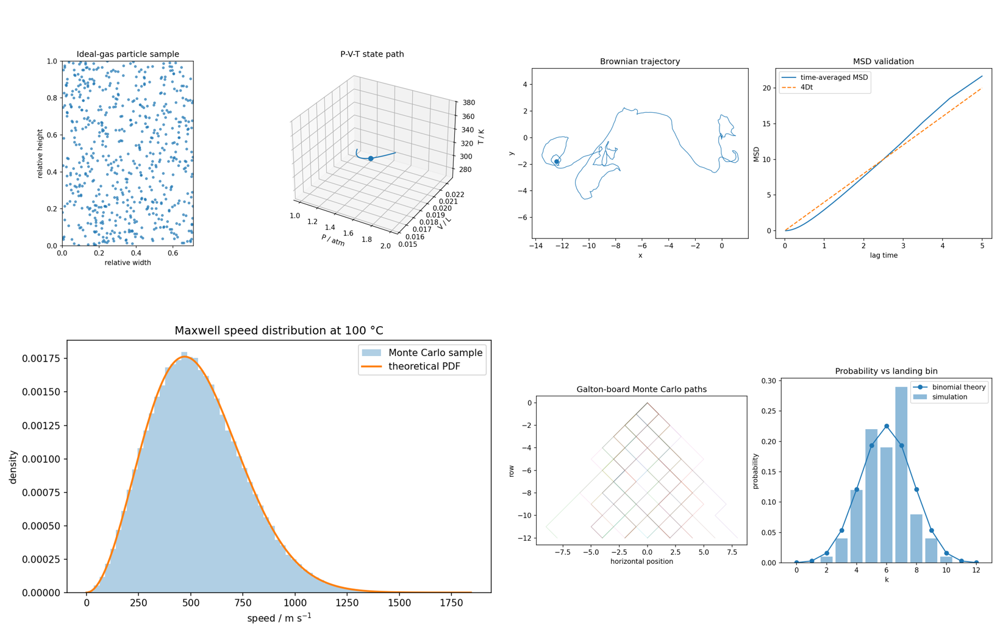

# HeatLab · 热学科学计算可视化

[](https://github.com/WALKERKILLER/heatlab/actions/workflows/ci.yml)
[](https://www.python.org/downloads/)
[](LICENSE)
[](CHANGELOG.md)

> 交互式热学科学计算实验台：理想气体 · 布朗运动 · 麦克斯韦速率分布 · 伽尔顿板  
> 提供 **桌面 GUI（PySide6）** 与 **浏览器实时动画（Flask + Canvas）** 两种入口。



---

## 目录

- [功能](#功能)
- [仓库结构](#仓库结构)
- [环境要求](#环境要求)
- [安装](#安装)
- [快速开始](#快速开始)
- [Web 实时机制](#web-实时机制)
- [API 摘要](#api-摘要)
- [测试与验证](#测试与验证)
- [物理建模边界](#物理建模边界)
- [文档](#文档)
- [贡献](#贡献)
- [许可证](#许可证)
- [引用](#引用)

## 功能

| 专题 | 内容 |
|---|---|
| **热力学 / 理想气体** | `PV=nRT`、分子热运动动画、P-V-T / 动能论轨迹 |
| **布朗运动** | 有惯性 Langevin、轨迹与 MSD / 扩散常数 |
| **麦克斯韦速率分布** | 理论 PDF + 蒙特卡洛直方图 + 粒子动画 |
| **伽尔顿板** | 蒙特卡洛下落路径与二项分布对照 |

三种使用方式：

1. **合并桌面版** — 一个窗口四个 Tab（`heatlab`）
2. **单专题桌面版** — `heatlab-ideal-gas` 等独立窗口
3. **浏览器实时版** — `heatlab-web` → <http://127.0.0.1:8765>

桌面 Matplotlib 图例/图注在深色主题下强制浅色文字并优先常规字重中文字体，避免黑字或细体字不可读。

## 仓库结构

```text
.
├── src/heatlab/           # 主包
│   ├── models/            # 数值模型（无 GUI）
│   ├── ui/                # 桌面界面
│   ├── web/               # Flask + 模板/静态资源/字体
│   ├── app.py             # 桌面 CLI
│   ├── randomness.py      # 可复现随机流
│   └── validation.py      # 离线验证出图
├── tests/                 # pytest
├── docs/                  # 架构与工作文档、任务原文
├── assets/                # 参考示意图
├── examples/validation/   # 入库的验证样例图
├── .github/               # CI · Issue/PR 模板
├── pyproject.toml         # 包装与入口脚本
├── requirements.txt       # 运行依赖
├── requirements-dev.txt   # 开发依赖
├── LICENSE                # MIT
├── CHANGELOG.md
├── CONTRIBUTING.md
├── CODE_OF_CONDUCT.md
├── SECURITY.md
├── CITATION.cff
└── THIRD_PARTY_NOTICES.md
```

更细的分层与数据流见 [docs/ARCHITECTURE.md](docs/ARCHITECTURE.md)。

## 环境要求

- Python **3.11 – 3.13**（推荐 3.12）
- 依赖：NumPy、SciPy、Matplotlib、PySide6、Flask（见 `pyproject.toml`）
- 推荐 [uv](https://github.com/astral-sh/uv) 管理虚拟环境

## 安装

```bash
git clone https://github.com/WALKERKILLER/heatlab.git
cd heatlab

# 推荐
uv venv --python 3.12
uv pip install -e ".[dev]"

# 或使用 pip
python -m venv .venv
source .venv/bin/activate   # Windows: .venv\Scripts\activate
pip install -e ".[dev]"
```

仅运行依赖：

```bash
pip install -r requirements.txt
pip install -e .
```

## 快速开始

### 桌面版

```bash
./.venv/bin/heatlab                  # 四专题合并窗口
./.venv/bin/heatlab --topic ideal-gas
./.venv/bin/heatlab-brownian --seed 20260807
```

| 命令 | 说明 |
|---|---|
| `heatlab` | 合并窗口 / 可用 `--topic` |
| `heatlab-ideal-gas` | 理想气体 |
| `heatlab-brownian` | 布朗运动 |
| `heatlab-maxwell` | 麦克斯韦 |
| `heatlab-galton` | 伽尔顿板 |

### 浏览器实时版

```bash
./.venv/bin/heatlab-web
# 默认 http://127.0.0.1:8765

./.venv/bin/heatlab-web --host 127.0.0.1 --port 8765
```

打开浏览器后：

- 顶部 **命令托盘**：改种子 →「应用并重置」
- **运行簇**：会话状态（实时中 / 已暂停 / 故障）+ 暂停/继续
- 下方四个专题 Tab；三栏：参数 | 场景 Canvas | 图表

> 开发服务器仅供本机实验；公网部署请换 WSGI 并阅读 [SECURITY.md](SECURITY.md)。

## Web 实时机制

1. `POST /api/session` 创建服务端会话（每标签页一份状态）
2. 前端 `requestAnimationFrame` 循环（约 30 FPS；伽尔顿稍慢）
3. 每帧 `POST /api/live/<topic>/step` 推进模型并返回数据
4. Canvas 重绘场景；Chart.js 刷新曲线/直方图
5. 暂停停止步进；重置按新种子重建会话

热力学 P-V 图同时含：

- **设定路径 (PV=nRT)**：宏观状态点轨迹  
- **动能论实时轨迹**：由 `N·m·⟨vₓ²⟩/V` 估计压强，帧间抖动

界面为 VS Code 风格工业扁平工作台 + lab-console 顶栏（brand plate、命令托盘、运行簇）。可用性：键盘 Tab、label、`aria-live` 状态栏、跳过链接、`prefers-reduced-motion`、内置 `HeatLab CJK` 字体。

## API 摘要

| 路径 | 说明 |
|---|---|
| `GET /api/health` | 健康检查（`mode=live`） |
| `POST /api/session` | 创建实时会话 |
| `POST /api/session/reset` | 按种子重置 |
| `POST /api/live/ideal-gas/set` · `/step` | 理想气体 |
| `POST /api/live/brownian/set` · `/step` · `/reset` | 布朗运动 |
| `POST /api/live/maxwell/set` · `/step` · `/reset` | 麦克斯韦 |
| `POST /api/live/galton/start` · `/step` | 伽尔顿板 |
| `GET /api/ideal-gas` 等 | 一次性快照（兼容） |

## 测试与验证

```bash
./.venv/bin/python -m compileall -q src tests
./.venv/bin/python -m pytest
./.venv/bin/ruff check src tests

# 重新生成验证图（输出到本地 validation_output/，不入库）
./.venv/bin/python -m heatlab.validation --output-dir validation_output
```

入库样例见 [examples/validation/](examples/validation/)。

**随机复现**：`numpy.random.Generator`，由全局种子派生四个命名流。默认种子 `20260807`。相同版本 + 种子 + 参数 → 可复现。

## 物理建模边界

- **理想气体**：视觉粒子忽略相互作用；T 控速度尺度，P/T 经状态方程决定 V  
- **布朗运动**：原文缺黏度等 SI 参数 → 无量纲 Langevin；质量滑条下限 `0.05 m₀`  
- **麦克斯韦**：默认氮气分子质量，温度 0–100 °C  
- **伽尔顿板**：固定 12 层、`p=0.5`；UI 粒子数 1–100  

## 文档

| 链接 | 内容 |
|---|---|
| [docs/README.md](docs/README.md) | 文档索引 |
| [docs/ARCHITECTURE.md](docs/ARCHITECTURE.md) | 架构 |
| [docs/HeatLab_代码工作文档.md](docs/HeatLab_代码工作文档.md) | 详细设计与验收 |
| [CHANGELOG.md](CHANGELOG.md) | 版本记录 |
| [CONTRIBUTING.md](CONTRIBUTING.md) | 如何贡献 |
| [SECURITY.md](SECURITY.md) | 安全披露 |

## 贡献

欢迎 Issue 与 PR。请先读 [CONTRIBUTING.md](CONTRIBUTING.md) 与 [CODE_OF_CONDUCT.md](CODE_OF_CONDUCT.md)。

## 许可证

本项目以 [MIT License](LICENSE) 发布。第三方依赖见 [THIRD_PARTY_NOTICES.md](THIRD_PARTY_NOTICES.md)。

内置字体 `DroidSansFallback.ttf` 用于 Web 中文显示，请遵守其上游许可条款。

## 引用

若本软件对你的教学或研究有帮助，可使用 [CITATION.cff](CITATION.cff)：

```bibtex
@software{HeatLab2026,
  title  = {HeatLab: Thermal Physics Scientific Computing Lab},
  author = {{HeatLab project team}},
  year   = {2026},
  version = {0.1.0},
  license = {MIT}
}
```

---

**仓库地址**：<https://github.com/WALKERKILLER/heatlab>
