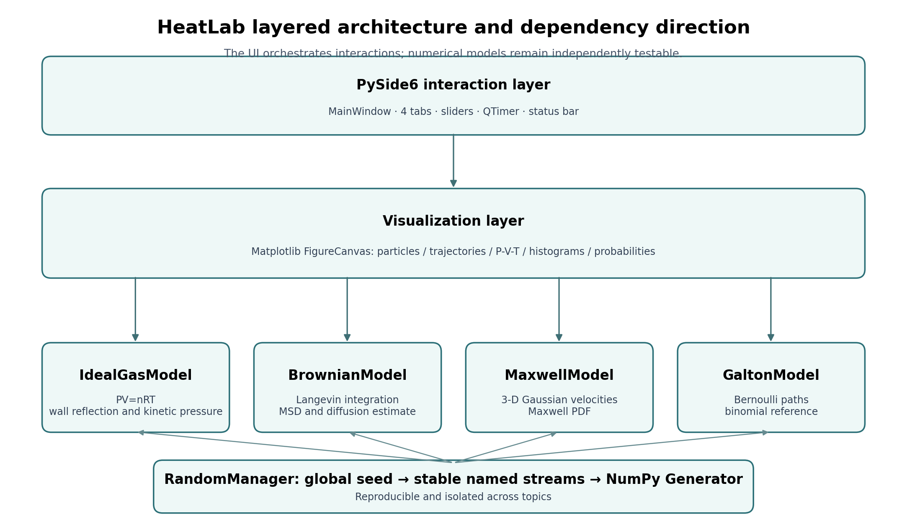

# 目录 {.unnumbered}

| 基础、物理与算法 | 工程、核查与验收 |
|---|---|
| 文档状态与结论 | 9. GUI 组件模板与交互规范 |
| 1. 原始需求基线与解释 | 10. 自动化测试与核查结果 |
| 2. 技术路线与开源参考核查 | 11. 安装、运行与开发 |
| 3. 总体架构 | 12. TODO 路线图 |
| 4. 随机算法与可复现设计 | 13. 对照原始文档的验收清单 |
| 5. 专题一：理想气体 | 14. 发布验收操作脚本 |
| 6. 专题二：布朗运动与扩散常数 | 15. 已知限制与风险 |
| 7. 专题二：麦克斯韦速率分布 | 附录 A：关键算法伪代码 |
| 8. 专题二：伽尔顿板蒙特卡洛 | 附录 B：提交物说明 |

# 文档状态与结论

本文档给出一套可直接继续开发、运行和验收的 Python/Web 热学科学计算程序。实现范围严格对应原始任务文档中的四项内容：理想气体、布朗运动、气体分子速率的麦克斯韦分布、伽尔顿板蒙特卡洛模拟。当前演示入口以 Web 版为主，Windows 通过 PyInstaller 封装为“浏览器界面 + 本地 Flask 后端”的一键 exe；旧版 PySide6 窗口仅保留为源码对照。原文“专题三：综合设计”仅标注“待续”，因此本版本不擅自增加第五个专题，而是预留扩展接口。

本次交付包含：

- 完整 Python 工程源码，采用 `src/` 布局；
- PySide6 桌面 GUI，四个专题分别作为 Tab（旧源码入口）；
- Web + Flask 后端 Windows 一键演示版：`HeatLab-Web.exe` 自动启动本地服务并打开浏览器；
- NumPy/SciPy 数值实现与 Matplotlib 可视化；
- 全局随机种子和相互隔离的命名随机流；
- 29 个自动化测试；
- 无 GUI 环境下可运行的数值与图形核查脚本；
- 本代码工作文档、分级 TODO、逐条验收清单。

**核查结论：**源码已通过 Python 字节码编译检查；自动化测试覆盖模型与 Web 启动器；四组无头渲染验证图已成功生成并人工检查。Web UI 是主要演示界面，Windows 一键 exe 由 GitHub Actions 构建并通过后端健康检查、首页和静态资源冒烟检查；旧版 PySide6 GUI 的实际启动、拖动和跨平台 DPI 表现不再作为主要发布路线。

# 1. 原始需求基线与解释

## 1.1 原始文档可确认的功能

| 编号 | 原始任务 | 原文明确要求 | 本实现 |
|---|---|---|---|
| H-01 | 理想气体 | `PV=nRT`；封闭空间内分子无规则热运动；温度和压强改变时体积及热运动随之改变 | 粒子动画、可变容器宽度、温度决定速度尺度、压强/温度共同决定体积 |
| H-02 | 理想气体相图 | 给出 `(P,V)` 坐标值，轨迹只显示 PV 曲线 | **3D P-V-T 相图**（Plotly，给出 `(P,V,T)` 坐标值）与 **P-V / P-T / V-T 平面图**；等温/等压/等容过程模式与理论过程线 |
| H-03 | 理想气体参数 | 温度 0–100 °C；压强 1–2 atm | 两个范围受限滑条，实时刷新；等容模式压强由温度计算 |
| H-04 | 布朗运动 | 大量液体分子撞击花粉粒子，绘制花粉粒子运动轨迹 | 有惯性的二维 Langevin 随机微分方程离散模拟、轨迹图、MSD 图 |
| H-05 | 布朗运动参数 | 花粉粒子质量 0–m0；液体分子数量 1–100 | 质量比滑条和碰撞分子数量滑条；数值端将零质量安全映射为 0.05m0 |
| H-06 | 麦克斯韦分布 | 固定体积，仅温度变化；大量分子热运动变化；**几率~水平速度曲线** | 固定方盒粒子动画、速率 f(v) 与**水平分量 v_x 高斯分布双图**（理论曲线 + 样本直方图）、三种特征速度 |
| H-07 | 麦克斯韦参数 | 温度 0–100 °C | 范围受限滑条 |
| H-08 | 伽尔顿板 | 粒子从中央下落，经钉板进入槽；概率–位置曲线；采用蒙特卡洛算法 | 逐层 Bernoulli 左/右选择、下落路径动画、落槽频率和二项理论对照 |
| H-09 | 伽尔顿参数 | 粒子数 1–100 | 整数滑条/批次控制，严格限幅 |
| H-10 | 综合设计 | 待续 | 不虚构需求；保留新增 Tab 和新模型的扩展点 |

## 1.2 对原始页面示意图的界面解读

原文第 1 页提供三张参考画面：一个三维透明容器粒子场、一个二维活塞式容器，以及一个深色“左侧控制栏 + 右侧主视图”的科学可视化页面。本实现没有照抄网页，而是提取以下稳定设计语言：

1. 主视图优先展示运动与统计图；
2. 参数集中在独立控制面板；
3. 深色背景提高亮色粒子和曲线的可辨识度；
4. 动画必须支持暂停、重置与实时指标；
5. 同一专题同时展示微观过程与宏观关系。

## 1.3 必须显式说明的缺失参数

原始文档并未给出：气体种类、物质的量、容器实际几何尺寸、布朗流体温度、黏度、花粉粒子半径、`m0` 的绝对值、伽尔顿板钉排数和左右偏转概率。科学计算程序不能把这些未给出的量伪装成原始要求，因此实现采用以下可审计假设：

- 气体默认视为氮气，用于赋予分子质量和 m/s 速度量纲；理想气体宏观状态取 `n=1.0e-3 mol`，只影响显示的升数，不改变规律；
- 布朗运动采用无量纲单位，设阻尼 `gamma=1`、热能 `theta=1`，故长期理论扩散常数 `D=theta/gamma=1`；
- `m=0` 会使 Langevin 方程中加速度项奇异，UI 的“0”端点在模型内解释为 `0.05m0`，界面和文档均提示；
- 伽尔顿板固定 12 排，左右概率均为 0.5，理论落槽位置服从 `Binomial(12, 0.5)`。

# 2. 技术路线与开源参考核查

## 2.1 选型

| 层 | 采用组件 | 用途 | 选择理由 |
|---|---|---|---|
| 语言 | Python 3.11–3.13 | 全工程 | 科学计算生态完整，便于课程项目审查 |
| 数组/随机 | NumPy 2.x | 向量化、PRNG | `Generator/default_rng` 可显式管理随机状态 |
| 统计分布 | SciPy 1.13+ | Maxwell PDF、Binomial PMF | 用成熟实现作为理论曲线交叉核查 |
| 绘图 | Matplotlib 3.9+ | 图形、动画画布 | 适合科学图、支持嵌入 Qt GUI |
| GUI | PySide6 6.8+ | 桌面交互 | Qt 官方 Python 绑定，Slider/QTimer/Tab 组件齐全 |
| 测试 | pytest | 单元与统计测试 | 测试函数清晰，便于 CI |
| Windows Web 打包 | PyInstaller + `web.launcher` | `HeatLab-Web.exe` | 封装 Flask 后端、模型、模板和静态资源；浏览器端 CDN 依赖仍需联网 |

## 2.2 借鉴边界

本项目参考了下列项目的公开 API、示例组织方式和统计分布定义，但**没有复制第三方项目源码**：

- NumPy random：<https://numpy.org/doc/stable/reference/random/>；GitHub：<https://github.com/numpy/numpy>
- SciPy `stats.maxwell`：<https://docs.scipy.org/doc/scipy/reference/generated/scipy.stats.maxwell.html>
- SciPy `stats.binom`：<https://docs.scipy.org/doc/scipy/reference/generated/scipy.stats.binom.html>
- Matplotlib Qt 嵌入示例：<https://matplotlib.org/stable/gallery/user_interfaces/index.html>；GitHub：<https://github.com/matplotlib/matplotlib>
- Qt for Python/PySide6：<https://doc.qt.io/qtforpython-6/>；GitHub：<https://github.com/pyside/pyside-setup>
- PyQtGraph（性能升级候选，当前未作为依赖）：<https://github.com/pyqtgraph/pyqtgraph>

访问与核查日期：2026-08-07。

## 2.3 许可证注意事项

项目自身的原创源码在 `pyproject.toml` 中标为 MIT。NumPy、SciPy、Matplotlib 和 PySide6 各自仍受其原许可证约束。尤其是发布包含 Qt/PySide6 的二进制包时，应保留许可证文本和第三方通知，并根据实际分发方式复核 LGPL/GPL/商业许可义务。本段是工程提醒，不构成法律意见。

# 3. 总体架构

{width=92%}

架构遵循“数值模型与 GUI 解耦”原则：

- `models/` 不依赖 PySide6，可以由 pytest、命令行脚本或 Jupyter 直接调用；
- `ui/` 只负责参数读取、定时器调度和画布更新；
- `RandomManager` 统一生成随机流，禁止模型内部调用全局 `np.random.*`；
- `validation.py` 在 `Agg` 后端运行，适合无显示器 CI；
- 理论公式和随机样本并列绘制，避免“画面看起来正确但算法不可验证”。

## 3.1 工程目录

```text
heat_sciviz/
├── pyproject.toml
├── requirements.txt
├── requirements-dev.txt
├── README.md
├── LICENSE
├── THIRD_PARTY_NOTICES.md
├── assets/
│   ├── source_ideal_gas_3d.png
│   ├── source_piston_2d.png
│   └── source_dark_ui.png
├── docs/
│   ├── HeatLab_代码工作文档.md
│   └── architecture.png
├── src/heatlab/
│   ├── app.py
│   ├── constants.py
│   ├── randomness.py
│   ├── validation.py
│   ├── models/
│   │   ├── ideal_gas.py
│   │   ├── brownian.py
│   │   ├── maxwell.py
│   │   └── galton.py
│   └── ui/
│       ├── common.py
│       ├── main_window.py
│       ├── ideal_gas_tab.py
│       ├── brownian_tab.py
│       ├── maxwell_tab.py
│       └── galton_tab.py
├── tests/
│   ├── test_randomness.py
│   ├── test_ideal_gas.py
│   ├── test_brownian.py
│   ├── test_maxwell.py
│   └── test_galton.py
└── validation_output/
    ├── validation_results.json
    └── validation_*.png
```

## 3.2 核心类职责

| 类/数据类 | 主要状态 | 主要方法 | 不负责的内容 |
|---|---|---|---|
| `RandomManager` | `seed` | `stream(name)` | 不存 GUI 状态，不做密码学随机 |
| `IdealGasState` | T、P、n、粒子数、分子质量 | K/Pa/体积等属性 | 不更新粒子位置 |
| `IdealGasModel` | 位置、速度、P-V-T 历史 | `set_conditions`、`step`、`kinetic_pressure_pa`、`reset` | 不创建图形控件 |
| `BrownianParameters` | 质量比、分子数、阻尼、热能、dt | `effective_mass`、`theoretical_diffusion` | 不保存轨迹 |
| `BrownianModel` | 位置、速度、轨迹、时间 | `step`、`msd_curve`、`empirical_diffusion`、`ensemble_diffusion_estimate` | 不决定 UI 刷新频率 |
| `MaxwellState` | T、分子质量、粒子数 | `temperature_k`、`scale` | 不生成图 |
| `MaxwellModel` | 粒子位置、三维速度 | `set_temperature`、`distribution_curve`、`sampled_speeds`、`step` | 不管理随机种子 |
| `GaltonParameters` | 排数、向右概率、粒子数 | 数据容器 | 不保存批次结果 |
| `GaltonBatch` | 路径、落槽、频数、经验/理论概率 | 数据容器 | 不重复模拟 |
| `GaltonModel` | RNG、参数 | `simulate` | 不负责动画插值 |
| `MainWindow` | Tab、种子控件 | `rebuild_tabs` | 不实现物理算法 |
| 四个 `*Tab` | 控件、画布、QTimer | 事件处理、绘图刷新 | 不直接生成随机数 |

# 4. 随机算法与可复现设计

## 4.1 目标

随机模拟的验收困难通常来自三个问题：不能复现、多个模块争用同一随机状态、改变一个专题会连带改变另一个专题。为避免这些问题，程序采用“一个全局种子 + 稳定名称派生”的结构。

```python
manager = RandomManager(seed=42)
gas_rng = manager.stream("ideal-gas")
brown_rng = manager.stream("brownian")
maxwell_rng = manager.stream("maxwell")
galton_rng = manager.stream("galton")
```

`RandomManager.stream()` 不使用 Python 内置 `hash()`，因为它默认跨进程随机化。流名称先经 BLAKE2s 转成稳定的 32 位种子字，再与用户种子一起传入 NumPy `SeedSequence` 和 `default_rng`。

## 4.2 随机流约束模板

每个新模型必须满足：

```python
@dataclass(slots=True)
class NewModel:
    rng: numpy.random.Generator

    def simulate(self, ...):
        # 允许：self.rng.random / normal / uniform / integers
        # 禁止：np.random.random / random.random
        ...
```

测试模板：

```python
def test_new_model_is_reproducible():
    a = NewModel(RandomManager(123).stream("new-model"))
    b = NewModel(RandomManager(123).stream("new-model"))
    assert np.array_equal(a.simulate(), b.simulate())
```

## 4.3 随机算法清单

| 专题 | 随机变量 | 生成方法 | 理论对照 |
|---|---|---|---|
| 理想气体 | 初始位置均匀、速度分量高斯 | `rng.random`、`rng.normal` | 动能论压强、`PV=nRT` |
| 布朗运动 | 分子撞击方向均匀 | `rng.uniform(0,2pi)` | `MSD≈4Dt`、`D=theta/gamma` |
| 麦克斯韦 | x/y/z 速度分量独立高斯 | `rng.normal(0, sqrt(kT/m))` | SciPy Maxwell PDF、均速 |
| 伽尔顿板 | 每排向右 Bernoulli(p) | `rng.random < p` | 二项分布 PMF |

# 5. 专题一：理想气体

## 5.1 物理模型

状态方程：

```text
P V = n R T
V = n R T / P
```

温度由摄氏度转为开尔文；压强由 atm 转为 Pa。为了让拖动条在画面上直观改变容器体积，场景采用 **3D 透明盒体**：长度方向按 `T/P` 相对参考状态缩放，并将显示长度限制在 `0.45–1.60`（高度与深度固定为显示单位）。因此该粒子箱是**相对显示体积**，不是严格按真实容器三维尺寸绘制；实际物理体积仍由 `V=nRT/P` 计算并在读数区显示。粒子位置为三维均匀采样，速度三分量独立采样自高斯分布，粒子按实时速率着色（慢=蓝 → 快=黄），温度升高时颜色整体变暖、显示箱体相对变长，变化一目了然。

单分子三维速度分量采样：

```text
v_x, v_y, v_z ~ Normal(0, k_B T / m)
```

碰壁使用弹性反射：越过六个面时镜像位置，并反转对应速度分量。改变温度时保留速度方向，速度乘以 `sqrt(T_new/T_old)`；改变压力时改变容器长度并按比例重映射 x 坐标。

微观压强核查采用动量通量关系：

```text
P_kinetic = N_physical * m * mean(v_x^2) / V
```

这使界面不仅展示状态方程，还能用随机分子速度估计宏观压强。

## 5.2 `IdealGasModel` 接口

```python
@dataclass(slots=True)
class IdealGasModel:
    rng: Generator
    state: IdealGasState
    positions: np.ndarray
    velocities_si: np.ndarray
    phase_history: list[tuple[float, float, float]]

    def set_conditions(self, temperature_c: float, pressure_atm: float) -> None: ...
    def set_process_mode(self, mode: str) -> None: ...
    def isotherm_line(self) -> tuple[np.ndarray, np.ndarray]: ...
    def isobar_line(self) -> tuple[np.ndarray, np.ndarray]: ...
    def isochore_line(self) -> tuple[np.ndarray, np.ndarray]: ...
    def process_line(self) -> tuple[np.ndarray, np.ndarray] | None: ...
    def step(self, dt: float = 0.020) -> None: ...
    def kinetic_pressure_pa(self) -> float: ...
    def resample_velocities(self) -> None: ...
    def reset(self) -> None: ...
```

`set_process_mode` 支持 `free` / `isothermal` / `isobaric` / `isochoric`，切换时锁定当前 T/P/V 作为约束锚点：

- 等温：温度锁定为等温线温度，拖动 P 执行压缩/膨胀，拖动 T 更换等温线；
- 等压：压强锁定为等压线压强，拖动 T 加热/冷却，拖动 P 更换等压线；
- 等容：体积锁定，温度驱动压强 `P=nRT/V`（UI 中压强滑条显示计算值并禁用）。

## 5.3 UI 与刷新流程

1. 温度滑条范围 0–100 °C；压强滑条范围 1–2 atm；
2. 过程模式按钮组（自由/等温/等压/等容）切换约束；等容下压强由温度计算回写；
3. 任意滑条变化调用 `set_conditions()`；
4. `QTimer` / Web `requestAnimationFrame` 周期调用 `step()`；
5. 场景为 3D 盒体：桌面用 Matplotlib 3D 散点（`_offsets3d` 逐帧更新 + 盒体 12 条棱），Web 用 Canvas 等轴投影；粒子按速率着色；显示速度系数 1.5（仅观感，不影响物理）；
6. 状态变化追加到最多 240 个 P-V-T 历史点；
7. **相图为 3D P-V-T 相图**（Plotly：可旋转、滚轮缩放、悬停坐标，给出 `(P,V,T)` 坐标值）+ **P-V / P-T / V-T 平面图**（等温线族/等容线族/等压线族），过程模式激活时叠加理论过程线（虚线）；桌面与 Web 各图可全屏放大；
8. 指标区显示 T、P、物理 V 和随机动能论估计；场景角标、参数说明与专题弹窗均提示“相对显示体积”边界；
9. Web 端服务层对相图几何做**签名缓存**，3D 相图 + 平面图每 4 帧重绘一次，粒子场景保持每帧。

## 5.4 验证点

- 数值恒等：`P*V` 与 `n*R*T` 相对误差小于 `1e-13`；
- 单调性：定压升温使体积增大，定温增压使体积减小；
- 统计性：大量速度样本得到的动能论压强与目标压强在容许误差内；
- 动画边界：所有粒子保持在当前盒子内。

# 6. 专题二：布朗运动与扩散常数

## 6.1 采用 Langevin 模型的原因

仅用“每步位置加一个高斯数”的普通随机游走无法体现花粉质量参数。为使原文“花粉粒子质量”真正进入算法，本实现使用有惯性的 Langevin 方程：

```text
m dv = -gamma v dt + sqrt(2 gamma theta) dW
dx = v dt
```

其中 `theta` 表示无量纲热能。长期极限的二维均方位移满足：

```text
MSD(t) = E(|x(t)-x(0)|^2) ≈ 4 D t
D = theta / gamma
```

质量主要改变短时间惯性与轨迹平滑程度；长期扩散常数在该模型中由热能和阻尼决定。这一分工比把“质量”直接乘到随机步长上更符合物理结构。

## 6.2 有限分子碰撞算法

原文要求可调“液体分子数量 1–100”。每个积分子步内生成 `N` 个随机撞击方向：

```text
u_i = (cos(phi_i), sin(phi_i)), phi_i ~ Uniform(0, 2pi)
xi_N = sqrt(2) * sum(u_i) / sqrt(N)
```

`1/sqrt(N)` 归一化保持总体噪声方差不随滑条错误增大；`N` 增大时，合成冲量因中心极限定理趋近高斯，同时小 `N` 保留更明显的离散碰撞感。

Euler–Maruyama 风格更新：

```python
velocity += -(gamma / m) * velocity * dt \
            + sqrt(2 * gamma * theta * dt) / m * kick
position += velocity * dt
```

## 6.3 零质量处理

原文范围写为 `0–m0`，但 `m=0` 会导致除零和无限加速度。实现选择：

- UI 仍按“质量比例”表达；
- 模型最小有效质量为 `0.05m0`；
- 所有输入再由 `np.clip` 限制到 `[0.05,1.0]`；
- 文档和界面备注该安全映射，不静默伪装为真正零质量。

## 6.4 轨迹和扩散估计

`msd_curve()` 使用多组对数间隔的滞后量，计算时间平均 MSD：

```text
MSD(lag) = mean(|x[i+lag]-x[i]|^2)
```

`empirical_diffusion()` 取 MSD 曲线后段线性拟合斜率并除以 4。单条随机轨迹的估计天然有较大波动，故验收主标准使用 `ensemble_diffusion_estimate()` 的 2000 条并行轨迹；单轨迹 D 只作为教学展示。

## 6.5 `BrownianModel` 接口

```python
class BrownianModel:
    def set_parameters(self, mass_ratio: float, molecule_count: int) -> None: ...
    def step(self, substeps: int = 4) -> None: ...
    def msd_curve(self) -> tuple[np.ndarray, np.ndarray]: ...
    def empirical_diffusion(self) -> float: ...
    def reset(self) -> None: ...

    @staticmethod
    def ensemble_diffusion_estimate(..., path_count=2000, steps=4000) -> float: ...
```

为防长时间运行导致内存无限增长，轨迹超过 4000 个显示点时删除最早的 1000 个点。

# 7. 专题二：麦克斯韦速率分布

## 7.1 理论公式

原始文档给出的速率分布可写为：

```text
f(v) = 4*pi * (m/(2*pi*k*T))^(3/2) * exp(-m*v^2/(2*k*T)) * v^2
```

令 `a=sqrt(kT/m)`，它等价于 SciPy `stats.maxwell(scale=a)` 的缩放形式。程序用两条独立路径交叉核查：

1. 理论曲线调用 SciPy `maxwell.pdf`；
2. 随机样本直接生成三个独立高斯速度分量，再取欧氏范数。

```python
components = rng.normal(0.0, sqrt(k*T/m), size=(count, 3))
speeds = np.linalg.norm(components, axis=1)
```

这避免“用同一个 `maxwell.rvs` 同时生成样本又验证自身”造成循环论证。

## 7.2 特征速度

```text
v_mp   = sqrt(2 k T / m)
v_mean = sqrt(8 k T / (pi m))
v_rms  = sqrt(3 k T / m)
```

程序和测试要求 `v_mp < v_mean < v_rms`。

## 7.3 固定体积分子动画

位置在单位正方形中，容器尺寸不随温度改变。温度变化时，将已有三维速度向量整体乘以 `sqrt(T_new/T_old)`，保持方向和样本相对结构；动画只取 x/y 分量并按 RMS 速度归一化到视觉尺度。理论图同步重绘，随机样本直方图用于与曲线对照。

## 7.4 验证点

- PDF 在数值积分区间内面积约等于 1；
- 20 万个随机样本的均速与理论均速相符；
- 特征速度顺序正确；
- 温度只改变速度尺度，不改变容器边界；
- UI 温度范围严格为 0–100 °C。

## 7.5 水平速度分量分布（对齐文档「几率~水平速度曲线」）

原始文档第 2 幅图要求“几率~水平速度曲线”，即单个速度分量 `v_x` 的分布。对三维麦克斯韦速度分布，任意分量服从高斯分布：

```text
f(v_x) = 1/(sqrt(2*pi)*a) * exp(-v_x^2/(2*a^2)),  a = sqrt(kT/m)
```

`MaxwellModel` 新增：

- `component_curve(points)`：返回 v_x 理论高斯 pdf 与 v 网格（覆盖 ±4σ）；
- `sampled_components(count)`：`rng.normal(0.0, scale, count)` 采样 v_x。

Web 与桌面图表区均改为双图：速率 `f(v)` 与水平分量 `f(v_x)`，理论曲线与蒙特卡洛样本直方图并列。测试验证分量 pdf 归一化、样本均值≈0、样本方差≈σ²。

# 8. 专题二：伽尔顿板蒙特卡洛

## 8.1 算法

一颗粒子经过 `r` 排钉子，每排执行一次独立 Bernoulli 试验：

```text
right_i ~ Bernoulli(p)
step_i = +1 if right_i else -1
path_j = sum(step_i, i<=j)
landing_bin = sum(right_i)
```

全部粒子一次向量化生成：

```python
decisions = rng.random((particle_count, rows)) < p
steps = np.where(decisions, 1, -1)
paths = np.column_stack((np.zeros(count), np.cumsum(steps, axis=1)))
final_bins = decisions.sum(axis=1)
```

经验概率是落槽计数除以粒子数。理论概率为：

```text
P(K=k) = C(r,k) p^k (1-p)^(r-k)
```

默认 `r=12,p=0.5`，用 SciPy `binom.pmf` 计算理论参照。

## 8.2 UI 动画与批次一致性

点击下落后先一次性生成整批路径，再由 UI 按行插值播放。这样：

- 动画中看到的路径与最终统计严格是同一批数据；
- 暂停或窗口卡顿不会改变随机结果；
- 重放速度与算法采样解耦；
- 粒子数受限为 1–100，避免低性能设备中画面过载。

## 8.3 小样本统计解释

原文最大粒子数只有 100，因此一次实验的样本均值和方差可能明显偏离理论值；这不是算法错误。程序并列展示理论 PMF，自动测试另用 20 万样本核查均值 `r*p=6` 和方差 `r*p*(1-p)=3`。验收时不应要求每一批 100 颗粒子的柱形图都“完美钟形”。

# 9. GUI 组件模板与交互规范

## 9.1 通用组件

`ui/common.py` 封装：

- `MplCanvas`：Matplotlib `FigureCanvasQTAgg`；
- `LabeledSlider`：滑条、名称、当前值格式化、数值映射；
- `ControlPanel`：统一深色控制区；
- `ButtonRow`：暂停、重置、重新采样等按钮布局。

新增专题可复用以下模板：

```python
class NewTopicTab(QWidget):
    def __init__(self, model):
        super().__init__()
        self.model = model
        self.canvas = MplCanvas(width=9, height=5)
        self.controls = ControlPanel("专题名称")
        self.timer = QTimer(self)
        self.timer.timeout.connect(self._tick)
        self.timer.start(30)

    def _parameters_changed(self, value):
        self.model.set_parameters(...)
        self._update_plot(full=True)

    def _tick(self):
        self.model.step()
        self._update_plot(full=False)

    def _reset(self):
        self.model.reset()
        self._update_plot(full=True)
```

## 9.2 动画性能原则

- 定时器只做一小步数值更新，禁止在 GUI 线程执行大规模 20 万样本测试；
- 可更新现有 Artist 时不 `clear()` 整张图；
- 理论曲线只在参数变化时重算；
- 粒子数量和历史长度设置上限；
- 统计验证放在 `validation.py` 或测试中；
- 后续若目标达到 60 FPS 且 Matplotlib 成为瓶颈，可将实时粒子画布替换为 PyQtGraph，但保留 Matplotlib 导出图。

## 9.3 输入验证与错误策略

| 输入/场景 | 处理 |
|---|---|
| 负随机种子 | `ValueError`；GUI SpinBox 本身禁止负数 |
| T 超范围 | 模型 `clip` 到 0–100 °C |
| P 超范围 | 模型 `clip` 到 1–2 atm |
| 分子数超范围 | `clip` 到 1–100 |
| 质量为零 | 映射到最小有效 0.05m0 |
| `dt<=0` | `ValueError` |
| Brownian `substeps<1` | `ValueError` |
| 轨迹过长 | 分块删除早期显示点 |
| 图形暂停 | 停止定时更新，不重置模型 |
| 缺少 PySide6 | 入口输出明确安装提示并以状态码 2 退出 |
| 更换全局 seed | 销毁并重建四个 Tab，确保初始状态一致 |

# 10. 自动化测试与核查结果

## 10.1 执行命令

```bash
cd heat_sciviz
PYTHONPATH=src python -m compileall -q src tests
PYTHONPATH=src pytest
PYTHONPATH=src python -m heatlab.validation --output-dir validation_output
```

## 10.2 测试结果

```text
29 passed
```

| 测试文件 | 覆盖点 |
|---|---|
| `test_randomness.py` | 同 seed/同名称完全复现；不同名称流不相同 |
| `test_ideal_gas.py` | 状态方程、体积单调性、微观压强统计一致性、3D 过程线 / PV=nRT 曲面网格、平面等值线族 |
| `test_brownian.py` | 轨迹复现、系综扩散常数收敛、液体分子留在盒内、与花粉不重叠、硬球碰撞触发 |
| `test_maxwell.py` | PDF 归一化、样本均速、特征速度顺序、分量分布 |
| `test_galton.py` | 路径复现、大样本二项矩、概率和为 1 |

## 10.3 本轮数值验证记录

| 指标 | 结果 | 判读 |
|---|---:|---|
| 理想气体目标压强 | 1.600000 atm | 设定值 |
| 动能论估计压强 | 1.599746 atm | 与目标高度一致 |
| 相对误差 | 0.000159 | 远小于 2.5% 测试阈值 |
| Brownian 理论 D | 1.000000 | 无量纲模型基准 |
| 单轨迹估计 D | 1.159666 | 单轨迹波动，供教学显示 |
| 2000 条系综估计 D | 0.944797 | 在 12% 相对容差内 |
| 布朗液体碰撞计数 | >0（100 分子 × 80 步） | 硬球碰撞已触发 |
| Maxwell PDF 数值面积 | 0.999999 | 归一化通过 |
| Maxwell 样本均速 | 530.798549 m/s | 20 万样本，100 °C |
| Maxwell 理论均速 | 531.062898 m/s | 与样本相符 |
| Maxwell y 轴固定上限 | 0.002062（0 °C 峰值） | 温度升高时曲线右移、峰值变矮 |
| Galton 100 粒子样本均值 | 5.990000 | 接近理论 6 |
| Galton 100 粒子样本方差 | 2.349900 | 小样本允许波动；不作为严格拒收项 |
| Galton 理论概率和 | 1.000000 | 通过 |

## 10.4 核查图

{width=96%}

该拼图来自实际模型和验证脚本，不是手工概念图。检查结果：坐标轴完整、中文以外的数学/单位符号正常、曲线和散点没有截断、理论与样本关系符合预期。

## 10.5 本轮未完成的核查

当前容器未安装 PySide6，且所用离线软件源没有对应 wheel。因此以下项目没有声称“已通过”：

- `python -m heatlab.app` 的真实窗口启动；
- 四个 Tab 的鼠标拖动和按钮交互；
- Windows 125%/150% DPI；
- Linux Wayland/X11；
- PyInstaller 打包后的资源路径与许可证文件。

这些事项均列为 P0 或发布前验收，不影响已完成的纯数值、测试和无头绘图核查，但在最终发布前必须补做。

# 11. 安装、运行与开发

## 11.1 建议环境

- Python 3.11、3.12 或 3.13；
- Windows 10/11、主流 Linux 桌面或 macOS；
- 首次安装需能访问 PyPI 或配置包含 PySide6 wheel 的镜像。

## 11.2 安装

```bash
python -m venv .venv

# Windows PowerShell
.venv\Scripts\Activate.ps1

# Linux/macOS
source .venv/bin/activate

python -m pip install --upgrade pip
python -m pip install -e ".[dev]"
```

## 11.3 运行

```bash
heatlab
# 或
python -m heatlab.app
```

## 11.4 测试和验证

```bash
pytest
python -m heatlab.validation --output-dir validation_output
```

## 11.5 代码质量建议

```bash
ruff check src tests
mypy src
```

当前 `pyproject.toml` 已预留 Ruff 和 mypy 依赖，但本轮验收主证据是编译、pytest 和数值图形验证。正式 CI 应将 lint/type check 加入强制步骤。

# 12. TODO 路线图

## P0：交付/演示前必须完成

- [x] Web 端已在浏览器实测：四专题切换、步进器/投放粒子、3D 相图旋转缩放、全屏放大、信息弹窗均正常。
- [x] Windows Web 一键演示版已纳入 GitHub Actions：`HeatLab-Web.exe` 启动本地 Flask 后端并打开默认浏览器，构建任务包含后端/首页/静态资源冒烟检查。
- [x] 将第三方许可证/NOTICE 整理进 `THIRD_PARTY_NOTICES.md`（含新增 Plotly / KaTeX / 借鉴项目）。
- [ ] 在装有 PySide6 的 Windows 11 环境执行 `python -m heatlab.app`，确认桌面窗口可启动和正常退出。
- [ ] 逐个拖动所有滑条到最小值、默认值、最大值，确认无异常、无 NaN/Infinity、标签值正确。
- [ ] 检查暂停、重置、重新采样、伽尔顿批次播放按钮。
- [ ] 连续运行每个动画至少 10 分钟，检查内存占用不持续失控、UI 不冻结。
- [ ] 在 100%、125%、150% DPI 下检查控制栏和图表不被裁剪。
- [ ] 在目标 Python 版本全新虚拟环境执行安装、测试、验证三条命令。
- [ ] 对最终 GUI 截图进行人工审阅并归档为验收证据。

## P1：课程作品质量增强

- [ ] 增加导出当前图为 PNG/SVG、导出当前参数与数据为 CSV/JSON。
- [x] 增加“等温过程/等压过程”模式锁定（已在热力学专题实现）。
- [ ] 理想气体增加粒子碰壁冲量的时间窗直接估计，与 `N m<v_x²>/V` 交叉比较。
- [ ] Brownian 增加黏度、粒子半径和绝对温度，并用 Stokes–Einstein `D=kT/(6*pi*eta*r)` 切换到 SI 单位模式。
- [ ] Brownian 增加多轨迹叠加和置信区间。
- [ ] Maxwell 增加气体种类选择（He、Ne、N2、O2、Ar）及质量说明。
- [ ] Galton 增加排数和偏置概率 p，但默认仍锁定原任务的 12、0.5。
- [ ] 所有图加入一键“恢复原始任务默认值”。
- [ ] 增加 GUI 层 pytest-qt 测试。

## P2：工程化与性能

- [x] Web 端性能优化：相图几何签名缓存、3D+平面图每 4 帧节流、麦克斯韦直方图降采样、粒子显示速度系数 1.5。
- [ ] GitHub Actions：Windows/Linux/macOS 矩阵测试。
- [x] PyInstaller 构建脚本和可复现 Windows Web release workflow（`HeatLab-Web-win64.zip`）。
- [ ] 实时高帧率部分评估迁移 PyQtGraph；静态出版图保留 Matplotlib。
- [ ] 将模型参数序列化为版本化 schema，支持实验配置保存/读取。
- [ ] 增加性能基准，记录 100/500/1000 粒子的帧率和 CPU 占用。
- [ ] 增加错误日志、崩溃报告和“复制环境信息”功能。
- [ ] 为“专题三：综合设计”预留插件注册接口，在新需求明确后再实现。

# 13. 对照原始文档的验收清单

以下清单可直接用于教师/项目负责人验收。状态含义：

- `[x]`：代码及无头数值/图形证据已核查；
- `[~]`：代码已实现，但需在有 PySide6 的桌面环境完成人工 GUI 核查；
- `[ ]`：未属于原文明确范围或仍待开发。

## 13.1 通用

- [x] G-01 使用 Python 实现，工程可安装，入口为 `heatlab` 或 `python -m heatlab.app`。
- [x] G-02 数值模型与界面解耦，可脱离 GUI 测试。
- [x] G-03 所有随机算法可通过全局 seed 复现。
- [x] G-04 四专题使用独立命名随机流，避免互相影响。
- [x] G-05 所有原文参数均有限幅和单位/含义显示。
- [x] G-06 提供自动化测试、验证脚本和结果 JSON。
- [~] G-07 桌面程序真实启动及全控件人工操作通过。

## 13.2 理想气体

- [x] IG-01 公式 `PV=nRT` 在模型中实际参与体积计算。
- [x] IG-02 封闭空间中有大量分子无规则运动。
- [x] IG-03 温度改变时分子速度尺度随 `sqrt(T)` 改变。
- [x] IG-04 温度/压强改变时容器体积随 `T/P` 改变。
- [x] IG-05 温度范围 0–100 °C。
- [x] IG-06 压强范围 1–2 atm。
- [x] IG-07 输出 P、V、T 当前坐标值。
- [x] IG-08 绘制三维 P-V-T 状态轨迹（Plotly：可旋转/缩放/悬停）。
- [x] IG-09 微观动能论压强与宏观压强统计一致。
- [x] IG-10 Web 端拖动滑条时动画与三维图实时顺畅刷新（相图几何缓存 + 每 4 帧重绘）。
- [x] IG-11 P-V / P-T / V-T 平面图（等温/等容/等压线族）与 3D 相图同屏。

## 13.3 布朗运动

- [x] BM-01 随机冲量由多分子撞击方向合成。
- [x] BM-02 花粉粒子轨迹连续绘制。
- [x] BM-03 质量参数进入 Langevin 惯性项。
- [x] BM-04 分子数量范围 1–100。
- [x] BM-05 原文零质量端点具有明确安全处理，不发生除零。
- [x] BM-06 显示 MSD 与理论 `4Dt` 对照。
- [x] BM-07 输出单轨迹扩散常数估计。
- [x] BM-08 系综验证的 D 在预设统计容差内。
- [x] BM-09 质量和分子数拖动后轨迹表现实时更新（Web 端已验证）。
- [x] BM-10 液体分子间硬球弹性碰撞（不重叠、留在盒内、碰撞计数）。
- [x] BM-11 轨迹方向箭头 / 液体速度矢量 / 轨迹渐隐 开关与图例。

## 13.4 麦克斯韦分布

- [x] MX-01 使用原文 Maxwell 速率分布等价公式。
- [x] MX-02 固定容器体积，温度改变分子运动速度。
- [x] MX-03 温度范围 0–100 °C。
- [x] MX-04 绘制概率密度–速率曲线。
- [x] MX-05 用独立三维高斯分量生成蒙特卡洛速率样本。
- [x] MX-06 直方图与理论曲线并列。
- [x] MX-07 PDF 数值积分归一化通过。
- [x] MX-08 样本均速与理论均速一致。
- [x] MX-09 显示最概然、平均和 RMS 速率。
- [x] MX-10 Web 端拖动温度时粒子动画和分布图无卡顿更新（步进节流 + 直方图降采样）。
- [x] MX-11 分布图使用线性数值轴：温度升高 → 曲线右移、变宽、峰值变矮（y 上限固定）。

## 13.5 伽尔顿板

- [x] GB-01 粒子从中央漏斗起点逐排左/右下落。
- [x] GB-02 使用明确的蒙特卡洛 Bernoulli 算法。
- [x] GB-03 粒子数范围 1–100。
- [x] GB-04 绘制多粒子下落路径（漏斗 → 钉板 → 狭槽，弧线插值）。
- [x] GB-05 统计不同狭槽落入数和经验概率。
- [x] GB-06 绘制概率–位置关系。
- [x] GB-07 与二项分布理论 PMF 对照。
- [x] GB-08 大样本均值与方差测试通过。
- [x] GB-09 同一批路径按行播放，结束后统计与动画一致（狭槽 hexagonal 堆积）。

## 13.6 综合设计

- [x] CD-01 未擅自虚构原文“待续”内容。
- [x] CD-02 架构允许通过新增模型和 Tab 扩展。
- [ ] CD-03 等用户补充专题三需求后实现综合设计。

# 14. 发布验收操作脚本

建议验收人员按以下顺序执行：

```bash
# 1. 创建干净环境
python -m venv .venv
.venv\Scripts\activate  # Windows
python -m pip install -U pip
python -m pip install -e ".[dev]"

# 2. 自动化验证
python -m compileall -q src tests
pytest
python -m heatlab.validation --output-dir validation_output

# 3. GUI 验收
python -m heatlab.app
```

GUI 人工验收步骤：

1. 记录启动系统、Python/浏览器版本和 DPI；若验收旧 GUI，再额外记录 PySide6 版本；
2. 固定 seed 为 `42`，截图四个专题默认状态；
3. 每个滑条依次拖到最小、最大、默认；
4. 检查数值标签、动画、曲线和状态栏；
5. 暂停后确认粒子停止；恢复后继续；
6. 点击重置，确认回到当前参数下的新初态；
7. 再次输入同 seed 并“应用并重置全部”，确认结果复现；
8. 让程序连续运行 10 分钟，记录 CPU 与内存；
9. 正常关闭程序，确认无后台残留进程。

Windows Web 一键演示版补充步骤：

1. 下载 Actions artifact `HeatLab-Web-win64`，解压并双击 `HeatLab-Web.exe`；
2. 确认默认浏览器自动打开本地实验台，四个专题和 CDN 脚本均正常加载；
3. 浏览器关闭后，确认演示结束时手动退出 `HeatLab-Web.exe`，避免本地 8765 端口继续占用；
4. 如 8765 已被占用，确认启动器能自动使用附近端口并打开正确地址。

# 15. 已知限制与风险

| 风险 | 当前影响 | 缓解措施 |
|---|---|---|
| 原文缺少 Brownian SI 参数 | 不能声称输出真实 m²/s | 明确标为无量纲；P1 增加 Stokes–Einstein 模式 |
| UI 最大 Galton N=100 | 单次分布波动明显 | 并列理论 PMF；大样本只用于测试 |
| Matplotlib 动画性能有限 | 旧版 PySide6 低端设备可能低帧率 | Web 版作为主要演示入口；桌面代码仅保留对照；控制粒子上限 |
| Web 依赖 CDN（Plotly / KaTeX / Chart.js） | 离线或内网无法加载 | 如需离线可在发布时本地化这些静态资源 |
| Web 一键 exe 关闭方式 | 关闭浏览器不会自动结束本地 Flask 进程 | README 明确要求演示结束时退出 `HeatLab-Web.exe`；后续可增加系统托盘/退出按钮 |
| 默认气体设为氮气 | 原文未指定气体 | UI/文档明确；P1 加气体选择 |
| 3D P-V-T 是状态轨迹而非传统物态相图 | “相图”原文字义可能宽泛 | 使用原文给出的 `(P,V,T)` 坐标；避免加入液/固相边界 |
| 视觉容器宽度做了限幅 | 极端状态画面不按绝对比例无限压缩 | 物理 V 数值不受限幅影响，界面标注相对宽度 |
| 桌面 PySide6 窗口仍待人工冒烟 | 未完成桌面窗口运行证据 | P0 在目标桌面环境冒烟测试（Web 端已在浏览器实测通过） |

# 附录 A：关键算法伪代码

## A.1 理想气体

```text
initialize:
    positions <- uniform points in current box
    velocities <- normal(0, sqrt(kT/m))

on T/P changed:
    T <- clamp(T, 273.15 K, 373.15 K)
    P <- clamp(P, 1 atm, 2 atm)
    V <- nRT/P
    velocities <- velocities * sqrt(T_new/T_old)
    box_width <- display_scale(T/P)
    append (P,V,T)

on timer:
    positions <- positions + normalized_velocity * dt
    reflect particles at walls
```

## A.2 Brownian

```text
for each substep:
    angles <- N uniforms in [0,2pi)
    kick <- sqrt(2) * sum((cos, sin)) / sqrt(N)
    v <- v - gamma/m*v*dt + sqrt(2*gamma*theta*dt)/m*kick
    x <- x + v*dt
append x to path
```

## A.3 Maxwell

```text
sigma <- sqrt(kT/m)
(vx,vy,vz) <- independent Normal(0,sigma)
v <- sqrt(vx^2+vy^2+vz^2)
plot histogram(v) against Maxwell(scale=sigma).pdf
```

## A.4 Galton

```text
decisions[N, rows] <- uniform(0,1) < p
steps <- right ? +1 : -1
paths <- cumulative_sum(steps, axis=row)
landing_bin <- number_of_rights
counts <- bincount(landing_bin)
empirical <- counts/N
theory[k] <- binomial_pmf(k, rows, p)
```

# 附录 B：提交物说明

| 提交物 | 用途 |
|---|---|
| `HeatLab_代码工作文档.docx` | 供审阅、打印和验收 |
| `HeatLab_代码工作文档.md` | 版本控制友好的原始文档 |
| `HeatLab-Web-win64.zip` | Windows Web + Flask 后端一键演示包 |
| `HeatLab_完整工程.zip` | 可运行源码、测试、资产和验证输出 |
| `validation_results.json` | 机器可读核查结果 |
| `validation_montage.png` | 四个专题图形证据 |
